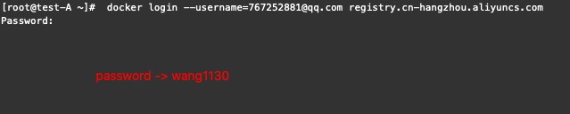

# docker配置

### 文件存放位置为: <font color=#008000>/etc/docker/</font>目录下,配置如下

```json
{
  "graph":"/data/docker",
  "storage-driver":"overlay2",
  "insecure-registries":["registry.accesss.redhat.com","quay.io"],
  "registry-mirrors":["https://vspy7yqr.mirror.aliyuncs.com"],
  "bip":"172.x.x.1/24",
  "exec-opts":["native.cgroupdriver=systemd"],
  "live-restore":true   
}

graph -> docker数据存放目录
storage-driver -> docker数据落地协议
insecure-registries -> Docker如果需要从非SSL源管理镜像,私有仓库设置地址
registry-mirrors -> 镜像加速地址
bip -> 设置本地dockoer 容器进程所使用的网段的网关地址 取本机的ip地址的最后俩位进行补充如故障后能快速定位事故主机容器
		 PS：本机IP： 192.168.3.100 dockerIP段：172.3.100.0/24
exec-opts -> 指定cgroup驱动为systemd
live-restore ->  docker engine down掉后不影响正在运行的docker容器进程
```


### aliyun registry、docker registry仓库登陆

- Aliyun Registry

  

- Docker Registry


**仓库密码存储位置<font color='#34F'> /root/.docker/config.json</font>，查看密码 “echo “加密字符串”｜base64 -d** 


