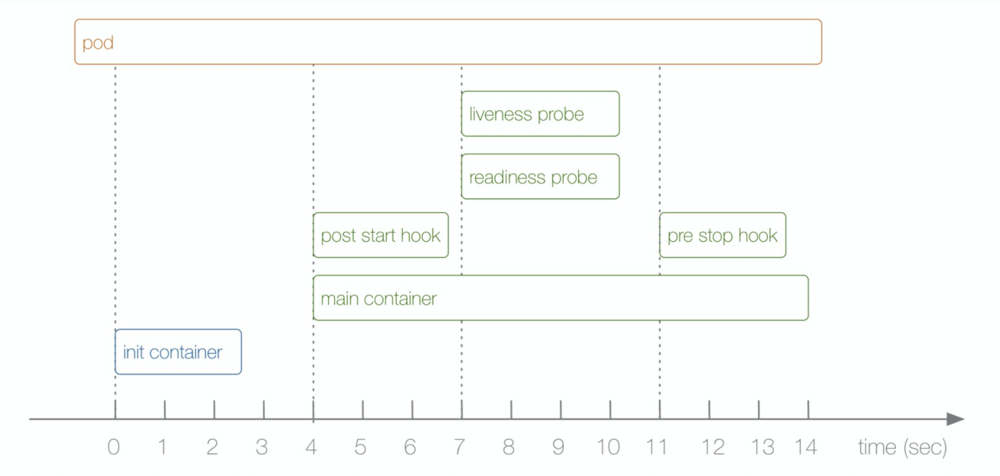

# Pod生命周期

### Pod的生命周期主要分为三个部分：

1. Init Container
2. Pod Hook
3. 健康检查



### Pod状态

```
pod的状态定义在 PodStatus 对象中，phase 字段对应着所有的描述状态

1. Pending(挂起)：Pod信息已经提交给了集群，但是还没有被调度器调度到合适的节点或者Pod里的镜像正在下载
2. Running(运行中)：该Pod已经绑定到了一个节点上，pod中所有的容器都已被创建。至少有一个容器正在运行，或者正处于启动或重启状态
3. Successded(成功)：Pod中所有的容器都被成功的终止，并且不会在重启
4. Failed(失败)：Pod中的所有容器都已终止，并且至少有一个容器是因为终止失败，也就是说，容器以非0状态退出或者被系统终止
5. Unknown(未知)：因为某些原因无法获取Pod的状态，通常是因为与Pod所在主机通信失败导致的
```


### 重启策略

```
通过配置 restartPolicy 字段来设置Pod中所有容器的重启策略，其值可能为：Always，OnFailure，Never

不同类型的控制其可以控制Pod的重启策略
job：适用于一次性任务，任务结束后Pod会被此类控制器清除，job的重启策略只能是 OnFailure 或 Never
Replication Controller, ReplicaSet, Deployment：此类控制器希望 Pod 一直运行下去，它们的重启策略只能是 Always
DaemonSet：每个节点上启动一个 Pod，很明显此类控制器的重启策略也应该是 Always
```


### 初始化容器

```
Init Contaier  ---> 初始化容器
可以是一个或者多个，这些容器会按定义的顺序依次执行，我们知道在pod中所有容器是可以共享一个mountVolume数据卷和 Network Namespace的，所以Init Container里面产生的数据可以被主容器使用到，从上面的生命周期图中可以看出初始化容器是独立于主容器之外的，只有所有的初始化容器执行完毕后主容器才会被启动。如果执行失败 pod 的状态也会相应随之更改

1. 等待其他模块Ready：用于解决服务之间的依赖问题，做存活检查 Ps：web服务需要连接数据库，可以在initContainer中做检查数据库是否启动
2. 做初始化配置，比如集群里检测所有已经存在的成员节点，为主容器准备好集群的配置信息，这样主容器起来后就能用这个配置信息加入集群
3. 其他场景，Ps：将Pod注册到一个中央数据
```


### Pod Hook

```
PodHook是由kubelet发起的，当容器中的进程启动前或者容器中的进程终止之前运行，这是包含在容器的生命周期之中。我们可以同时为Pod中所有的容器都配置hook

PostStart：这个钩子在容器创建后立即执行，但是，并不能保证钩子将在容器ENTRPOINT之前运行，因为没有参数传递给处理程序，主要用于资源部署，环境准备等，不过需要注意的是如果钩子话费太长时间以至于不能运行或者挂起，容器将不能达到running状态

PreStop：这个钩子在容器终止之前立即被调用，它是阻塞的，意味着它是同步的，所以它必须在删除容器的调用发出之前完成。主要用于优雅的关闭应用程序、通知其他系统等。如果钩子在执行期间挂起，Pod阶段将停留在running状态并且永远不会达到failed状态

如果PostStart、PreStop 钩子失败，它会杀死容器，所以我们应该让钩子函数尽可能的轻量
```


### Pod健康检查

```
liveness probe：kubelet通过使用liveness probe来确定你的应用程序是否正在运行，如果你的程序一旦奔溃了，Kubernetes就会立刻通知这个程序已经终止，然后就会重启这个程序，而我们的liveness probe的目的就是来捕获到当前应用程序还没有终止，还没有崩溃。如果出现了这些情况，那么就重启处于该状态下的容器，使应用程序在存在bug的情况下依然能够继续运行下去

readiness probe：kubelet使用readiness probe来确定容器是否已经就绪可以接受流量过来。只有当pod中的容器都处于就绪状态的时候kubelet才会认定该pod处于就绪状态，因为一个pod下面可能会有多个容器，当然pod如果处于非就绪状态，那么我们就会将它从Service的Endpoints列表中移除出去，这样我们的流量就不会被路由到这个pod中去了

startup probe：kubernetesv1.16+新增 启动探针，该探针将推迟所有其他探针，直到pod完成启动为止
```


