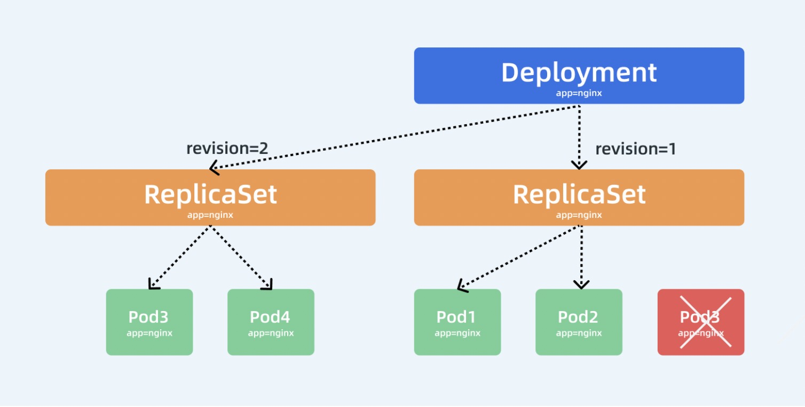

# Deployment控制器

```
Deployment一个非常重要的功能就是实现了pod的滚动更新，而我们的应用更新了，我们只需要更新我们的容器镜像，然后修改Deployment里面的pod模版镜像，那么Deployment就会用滚动更新(Rolling Update)的方式来升级现在的Pod，因为对于线上的服务我们需要做到不中断服务，所以滚动更新就成了必须的一个功能。而Deployment这个功能的实现，依赖的就是ReplicaSet这个资源对像，实际上我们可以理解成就是每个Deployment就对应集群中的一次部署
```


### Pod、ReplicaSet、Deployment三者之间的关系

```
Deployment 控制 ReplicatSet   -->   ReplicaSet 控制 Pod
每一级都是owner附属关系,所以可以说Deployment并不直接干预pod的运行方式
```


### 水平伸缩

```
水平扩展/收缩 的功能比较简单，因为ReplicaSet就可以实现，所以Deployment控制器只需要去修改RelicaSet中的relicas属性并应用，那么对应的ReplicaSet会接受更新信息对应的去控制Pod的数量
```


### 滚动更新

```
Deployment最重要的一个功能是支持 滚动更新。Deployment的滚动更新策略是重新配置一个ReplicaSet控制器并启动一个对应的Pod等待这个Pod状态为running时，将原ReplicaSet控制器下的Pod作出相应的delete操作，一个一个进行替换。来完成无缝更新操作
```




### Deployment相关操作

#### 查看更新状态

<font color=green>`kubectl rollout status deployment ${Deployment-Name} -n ${NameSpace}`</font>


#### 暂停更新、继续更新 (replicas定义数量不受影响)

暂停

<font color=green>` kubectl rollout pause  deployment ${Deployment-Name} -n ${NameSpace}` </font>

继续

<font color=green>` kubectl rollout resume deployment ${Deployment-Name} -n ${NameSpace}` </font>


#### 查看历史历史记录

<font color=green>` kubectl rollout history deployment ${Deployment-Name} -n ${NameSpace}` </font>


#### 回滚 上一版本 指定版本

上一版本

<font color=green>` kubectl rollout undo deployment ${Deployment-Name} -n ${NameSpace}` </font>

指定版本

<font color=green>` kubectl rollout undo deployment ${Deployment-Name} -n ${NameSpace} -to--revision=${Version} ` </font>


